# ScholiLink

> **⚠️ Notice: Portfolio Project & Archival Status**
>
> This repository is a **read-only portfolio piece**, published solely for educational and architectural review purposes. It is **not intended for production use**, will **not be actively maintained**, and is provided purely to demonstrate code quality, system design, and engineering patterns.
>
> **Pull Requests and Issues are not being accepted.** The author assumes **no liability** for any use of this code. See the [full disclaimer](#why-open-source-the-disclaimer) and [LICENSE](LICENSE) for details.

**ScholiLink** is a production-minded Flutter + Firebase student platform: one codebase, **local-first demo** (emulators + seeded data, no API keys) or **live cloud** (Auth, Firestore, Functions, Storage, Messaging, real Gemini). Riverpod on the client; TypeScript Cloud Functions own every sensitive path.

<p align="center">
  <a href="https://docs.flutter.dev/get-started/install"></a>
  <a href="https://dart.dev/get-dart"></a>
  <a href="https://firebase.google.com/"></a>
  <a href="https://nodejs.org/en/download"></a>
  <a href="https://www.typescriptlang.org/"></a>
  <a href="https://riverpod.dev/"></a>
  <a href="https://img.shields.io/badge/PRs-not%20accepted-red"></a>
  <a href="#why-open-source-the-disclaimer"></a>
</p>

---

## Why this repo exists

If you are tired of toy Flutter demos, this is the opposite: **real auth**, **real rules**, **real callable functions**, **real storage paths**, and **AI that never bypasses the server**. Fork it, run the one-command demo, and read the code like a senior engineer left you a map.

The UI ships with **polished light and dark themes**, **Greek-first localization** (English where appropriate), and surfaces for **schedule, homework workflow, grades, AI study help, class chat, exam-readiness quizzes, and university “Μόρια” planning** — all wired through the same production-shaped architecture. For a contributor-oriented inventory that tracks `lib/features/`, see [**docs/FEATURES.md**](docs/FEATURES.md).

---

## UI gallery

Screenshots live in [`docs/screenshots/`](docs/screenshots/). Filenames match [`docs/screenshots/MANIFEST.txt`](docs/screenshots/MANIFEST.txt) so the gallery below renders on GitHub.

### Light mode

<table>
  <tr>
    <td align="center" width="33%">
      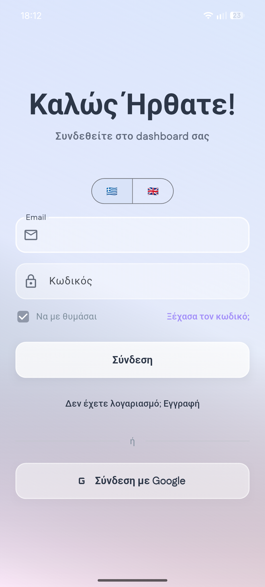
      <p><strong>Welcome &amp; sign-in</strong><br /><sub>Glassmorphism shell, bilingual toggle, email / password, Google, remember-me.</sub></p>
    </td>
    <td align="center" width="33%">
      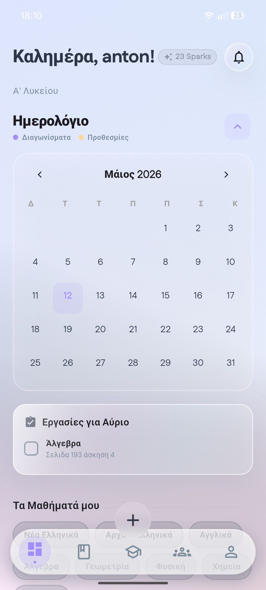
      <p><strong>Home command center</strong><br /><sub>Sparks, frosted calendar with exam vs deadline legend, tomorrow&apos;s tasks, subject chips.</sub></p>
    </td>
    <td align="center" width="33%">
      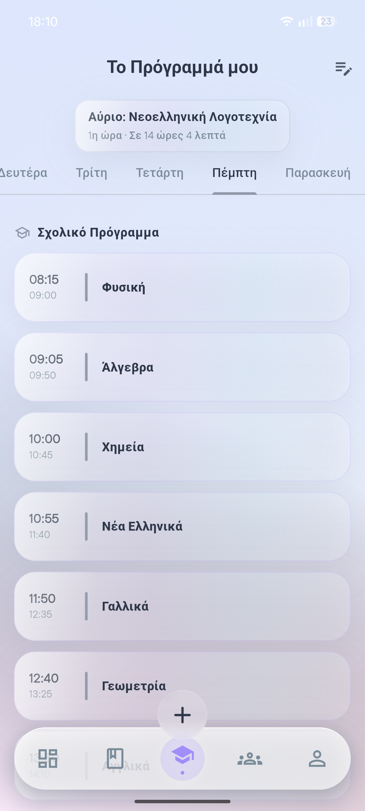
      <p><strong>Weekly timetable</strong><br /><sub>Next-class hero card, horizontal day picker, per-period subject cards.</sub></p>
    </td>
  </tr>
  <tr>
    <td align="center" width="33%">
      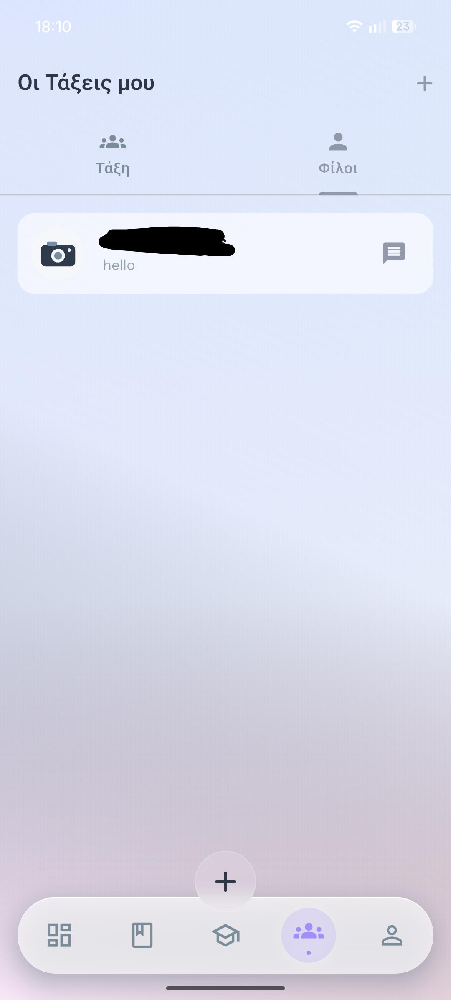
      <p><strong>Classes &amp; friends</strong><br /><sub>Tabbed social hub for cohorts and DMs with airy, glass UI.</sub></p>
    </td>
    <td align="center" width="33%">
      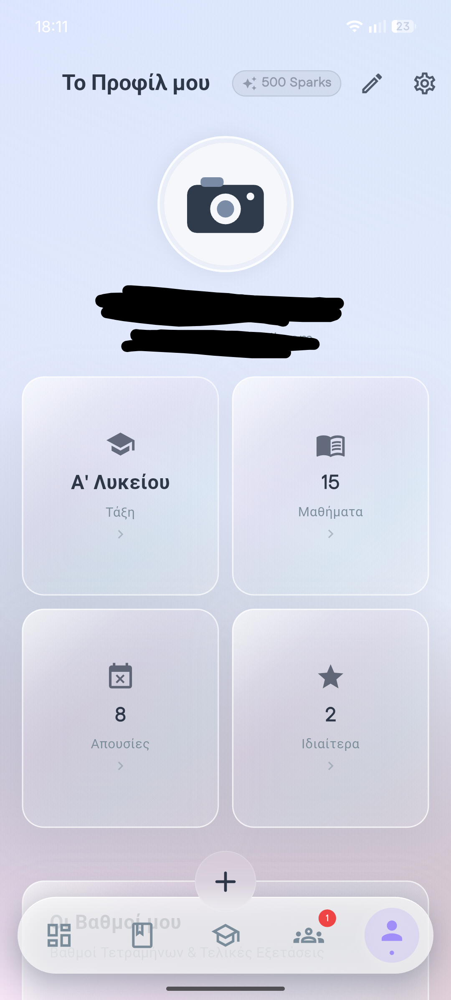
      <p><strong>Student profile</strong><br /><sub>Avatar, Sparks, grade band, lessons / absences / private-lesson stats.</sub></p>
    </td>
    <td align="center" width="33%"></td>
  </tr>
</table>

### Dark mode

<table>
  <tr>
    <td align="center" width="33%">
      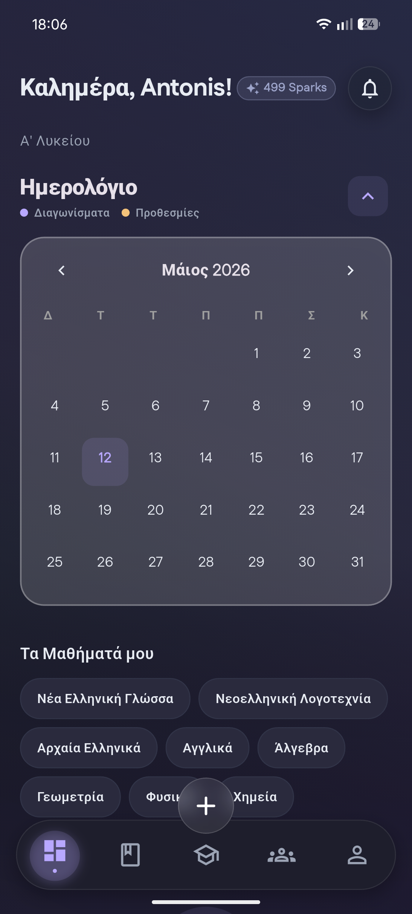
      <p><strong>Home at night</strong><br /><sub>Greeting, Sparks, calendar heatmap, course chips, floating nav + FAB.</sub></p>
    </td>
    <td align="center" width="33%">
      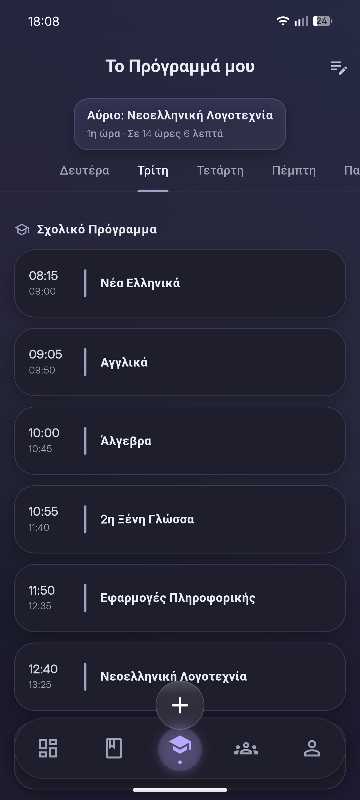
      <p><strong>Schedule focus</strong><br /><sub>Day tabs, countdown to the next lesson, dense timetable list.</sub></p>
    </td>
    <td align="center" width="33%">
      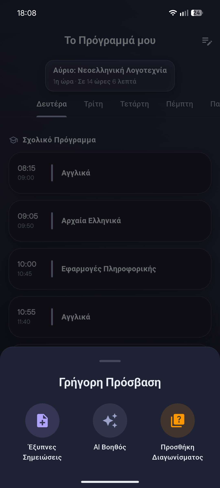
      <p><strong>Quick access</strong><br /><sub>Bottom sheet shortcuts to Smart Notes, AI Assistant, and Add Exam.</sub></p>
    </td>
  </tr>
  <tr>
    <td align="center" width="33%">
      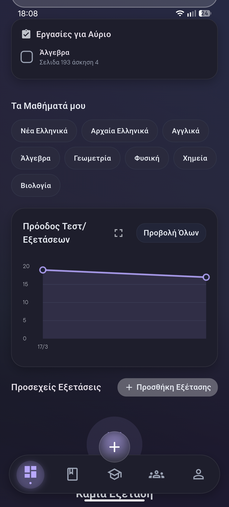
      <p><strong>Home, scrolled</strong><br /><sub>More of the dashboard story once you scroll past the fold.</sub></p>
    </td>
    <td align="center" width="33%">
      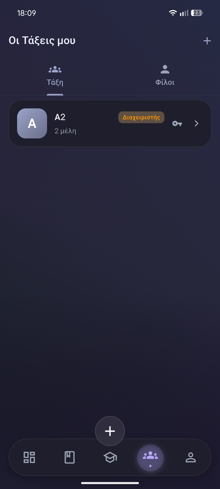
      <p><strong>Social hub</strong><br /><sub>Classes and friends flows with the same dark glass treatment.</sub></p>
    </td>
    <td align="center" width="33%">
      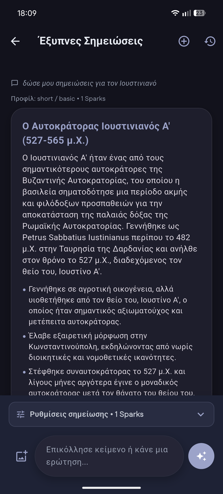
      <p><strong>Smart Notes</strong><br /><sub>AI-assisted note workspace for faster capture and review.</sub></p>
    </td>
  </tr>
  <tr>
    <td align="center" colspan="3">
      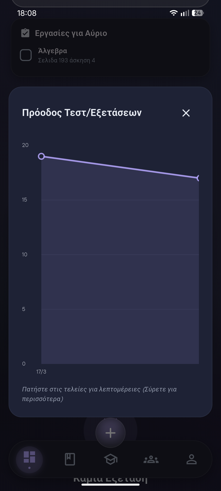
      <p><strong>Progress storytelling</strong><br /><sub>Tomorrow&apos;s tasks alongside interactive test / exam trend visualizations.</sub></p>
    </td>
  </tr>
  <tr>
    <td align="center" width="33%">
      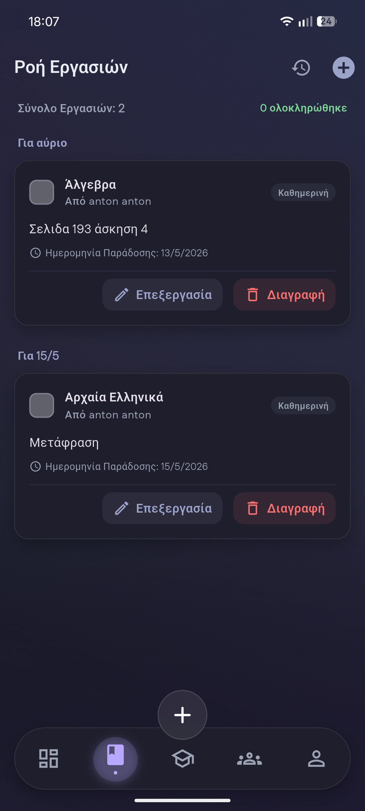
      <p><strong>Homework workflow</strong><br /><sub>Grouped by due date with inline edit / delete and progress counts.</sub></p>
    </td>
    <td align="center" width="33%">
      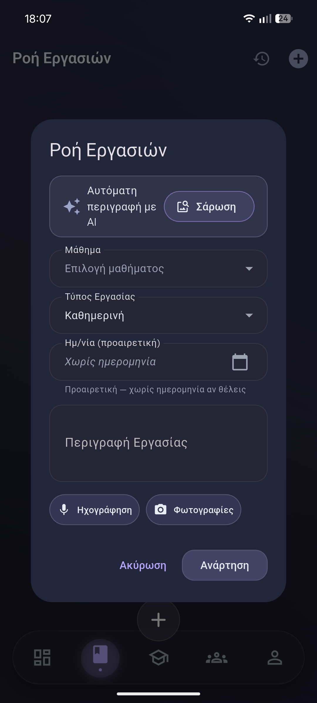
      <p><strong>Capture assignments</strong><br /><sub>AI-assisted description, subject + type pickers, voice / photo attachments.</sub></p>
    </td>
    <td align="center" width="33%">
      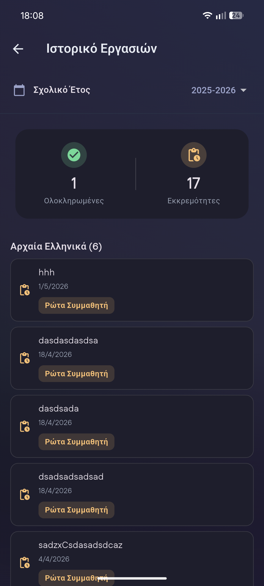
      <p><strong>Task history</strong><br /><sub>School-year filter, completed vs pending analytics, per-subject stacks.</sub></p>
    </td>
  </tr>
  <tr>
    <td align="center" width="33%">
      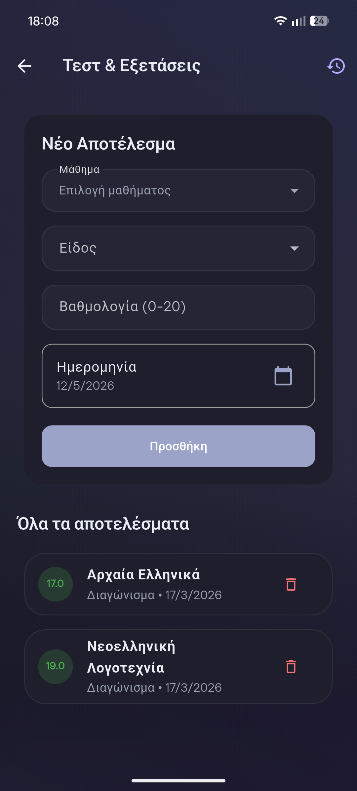
      <p><strong>Tests &amp; exams</strong><br /><sub>Add structured results (0–20 scale) and browse past performance.</sub></p>
    </td>
    <td align="center" width="33%">
      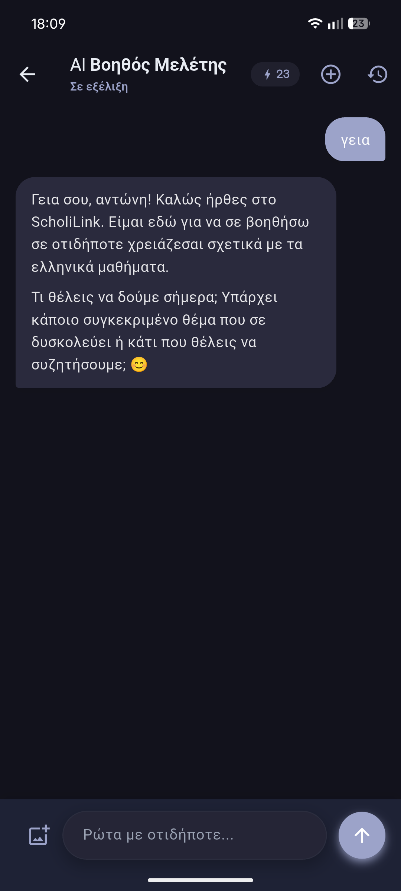
      <p><strong>AI study assistant</strong><br /><sub>Threaded help with credit meter, attachments, and ScholiLink-aware prompts.</sub></p>
    </td>
    <td align="center" width="33%">
      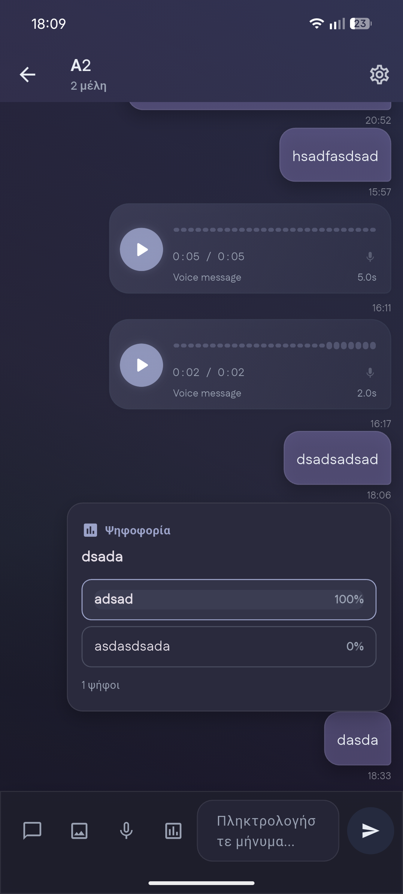
      <p><strong>Classroom chat</strong><br /><sub>Rich composer: text, media, voice notes, and live polls.</sub></p>
    </td>
  </tr>
  <tr>
    <td align="center" colspan="3">
      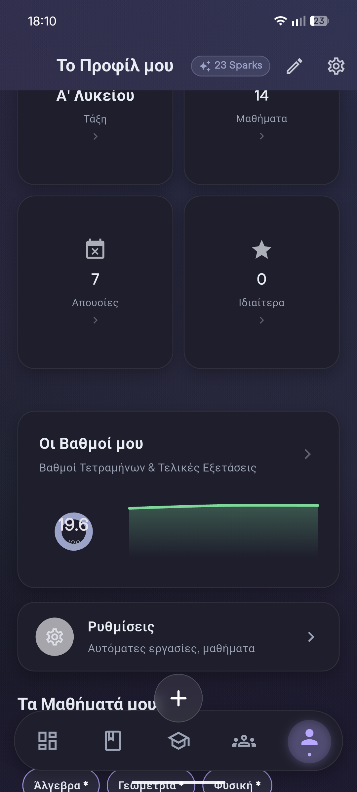
      <p><strong>Profile, scrolled</strong><br /><sub>Extra profile depth and stats once you explore below the hero.</sub></p>
    </td>
  </tr>
</table>

---

## Feature highlights

- **Dual-mode architecture** — Flip between Firebase Emulator Suite + deterministic AI mocks and full cloud + real Gemini without forking the app.
- **Server-authoritative backend** — Quotas, safety scoring, parental consent, social graph mutations, and AI orchestration live in TypeScript Cloud Functions.
- **Tight security rules** — Firestore and Storage rules are uid-scoped and field-locked; server-only collections are denied at the rules layer.
- **Full Firebase surface** — Auth (including Google Sign-In), Firestore, Functions, Storage, FCM, Hosting wiring.
- **AI done responsibly** — OCR, tutoring, smart notes, grade-aware flows, and exam quizzes call Gemini **only** through Functions, never from an API key in the client.
- **Student-grade UX** — Adaptive light/dark theming, Sparks gamification, calendar + workload storytelling, and collaborative flows tuned for daily school use.
- **Exam readiness loop** — Configure, take, and review AI-generated practice quizzes end to end.
- **Real-world school ops** — Deadline tracker with calendar export hooks, homework history by school year, and a Moria (“Μόρια”) calculator for Greek university orientation planning.
- **Collaboration depth** — Classrooms, friends, DMs, group chat with polls and voice notes, and classroom settings.
- **Lifecycle polish** — Registration, onboarding, password reset, parental consent storytelling, push and local notifications, deep links, and desktop-friendly navigation shells.

### Tech stack (short)

| Layer | Technologies |
| --- | --- |
| **App** | Flutter, Dart, Riverpod, `flutter_dotenv` |
| **Backend** | Firebase Cloud Functions (Node.js 22, TypeScript) |
| **Data** | Cloud Firestore, Firebase Storage |
| **AI** | Gemini (`@google/generative-ai`, server-side) |
| **Integrations** | Google Calendar helpers, device calendar, deep links (`app_links`), share sheet, local + push notifications |

---

## Quick start

```bash
git clone https://github.com/AntonisPsarras/Scholilink
cd Scholilink   # folder name matches the GitHub repo; use your path if you renamed it
```

> **Fork authors:** The committed `assets/.env.demo` and `functions/.env.demo` files contain Firebase project identifiers that belong to the original author. They are safe for the **local emulator demo** (the emulator is fully isolated). For any **live cloud** deployment you must create your own Firebase project and replace all `FIREBASE_*` values and `GOOGLE_CLIENT_ID` — see [**docs/INSTALL.md — Live cloud**](docs/INSTALL.md#live-cloud).

Then pick your path:

| You want… | Do this |
| --- | --- |
| **Fastest interactive demo** (recommended) | Follow **Local demo** in the [**full installation guide**](docs/INSTALL.md#local-demo) — one script starts emulators, seeds users, and launches the app. |
| **Real Firebase + Gemini** | Follow **Live cloud** in [**docs/INSTALL.md**](docs/INSTALL.md#live-cloud). |

**Demo logins** (local Auth emulator only, after `npm run seed:local` / the demo launcher): `student@example.com` / `Passw0rd!` and `teammate@example.com` / `Passw0rd!`. The demo `assets/.env` must use the **same `FIREBASE_PROJECT_ID` as the Firebase Emulator hub** — the committed `assets/.env.demo` uses **`student-dashboard-greece`** (see `.firebaserc` and `firebase.json`) so Auth, seed, and the app agree. See [docs/INSTALL.md — Local demo](docs/INSTALL.md#local-demo) and **Troubleshooting** if login fails.

---

## Contributing

This project is **not accepting contributions**. Pull Requests will not be reviewed or merged, and the issue tracker is not monitored. You are welcome to **fork the repository** and adapt the code freely under the [MIT License](LICENSE) — no support will be provided. See [CONTRIBUTING.md](CONTRIBUTING.md) for the full notice.

---

<a id="why-open-source-the-disclaimer"></a>

## Why open source? The disclaimer

> ⚠️ This repository is a **read-only, unmaintained portfolio showcase**. It is not a live production app, is not intended for minors, and will not receive updates or security patches. The author assumes **no liability** for any use of this code. It is provided strictly "AS IS" — see the [MIT License](LICENSE).

ScholiLink is open-sourced for portfolio review, technical evaluation, and interview discussion. It intentionally demonstrates real engineering patterns while stopping short of a production launch for under-18 users, due to three hard constraints:

1. **GDPR & youth-data compliance** — Deploying a social platform with AI features, chat, and grade data for minors requires a formal Data Protection Impact Assessment, legal bases for processing, verified parental consent mechanisms, data retention policies, and the right to erasure — all of which require legal counsel and operational infrastructure beyond the scope of a portfolio project.

2. **App Store Families Policy** — Apple and Google impose strict behavioral and content moderation requirements on apps in the "Kids" category and on any app that may be used by users under 13 (COPPA/GDPR-K). Chat features, social graphs, and external AI calls each require individual compliance review before store submission.

3. **Generative AI API terms of service** — Several AI providers (including Google AI Studio at certain tiers) restrict use by, or on behalf of, individuals under 18. Running AI features for a live minor-facing product requires either a compliant enterprise agreement or a verified age gate — neither of which is trivial to implement correctly.

Use this repository to evaluate code quality, architecture decisions, Firebase integration patterns, security rule design, and DX practices. Do not deploy it as a production app for minors without professional legal and compliance review.

---

## Docs map

| Document | What you will find |
| --- | --- |
| [**docs/INSTALL.md**](docs/INSTALL.md) | Prerequisites, toolchain checks, demo script, cloud setup, troubleshooting |
| [**docs/FEATURES.md**](docs/FEATURES.md) | Feature map aligned with `lib/features/` (parity checklist for docs vs code) |
| [**docs/PUBLISHING.md**](docs/PUBLISHING.md) | Pre-publish checklist (secrets, rules, CI, legal posture) |
| [**docs/PRIVACY-NOTICE.md**](docs/PRIVACY-NOTICE.md) | What data the app can process when deployed (not legal advice) |
| [**docs/LEGAL.md**](docs/LEGAL.md) | Third-party licenses and fork guidance |
| [**SECURITY.md**](SECURITY.md) | Vulnerability reporting and secrets scope |
| [**CONTRIBUTING.md**](CONTRIBUTING.md) | Fork-friendly notice — pull requests are not accepted |
| [**docs/screenshots/MANIFEST.txt**](docs/screenshots/MANIFEST.txt) | Filenames for every README screenshot slot |

---

## License / usage

This repository is released under the [MIT License](LICENSE). You are free to fork and use the code for any purpose permitted by that license.

The software is provided **"AS IS", WITHOUT WARRANTY OF ANY KIND**, express or implied. The author assumes no liability for any use of this code, including (but not limited to) deployment as a production application for minors. Any such use would require independent legal and compliance review that is entirely the responsibility of the party deploying the software.
